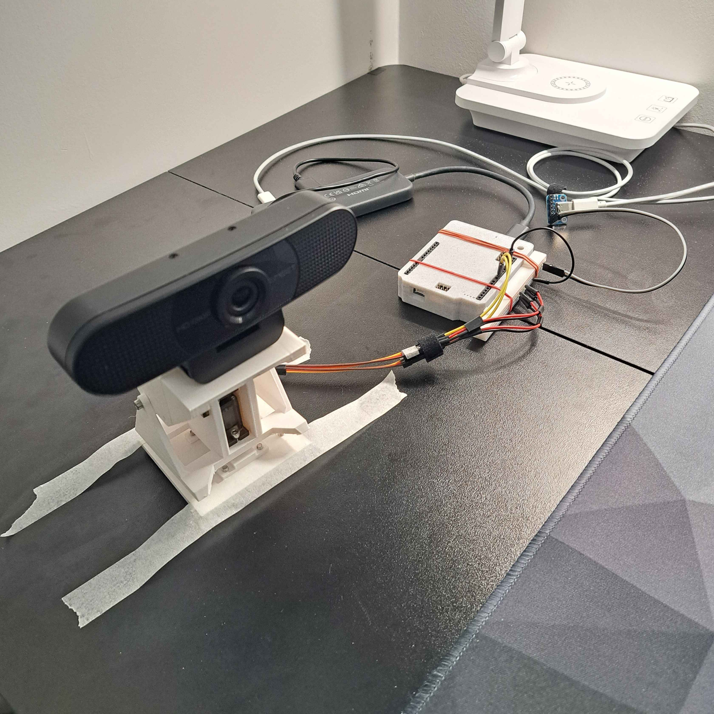
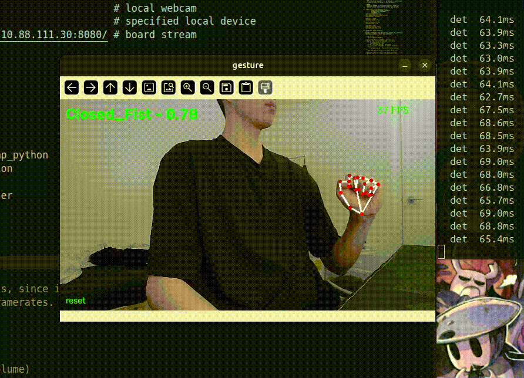
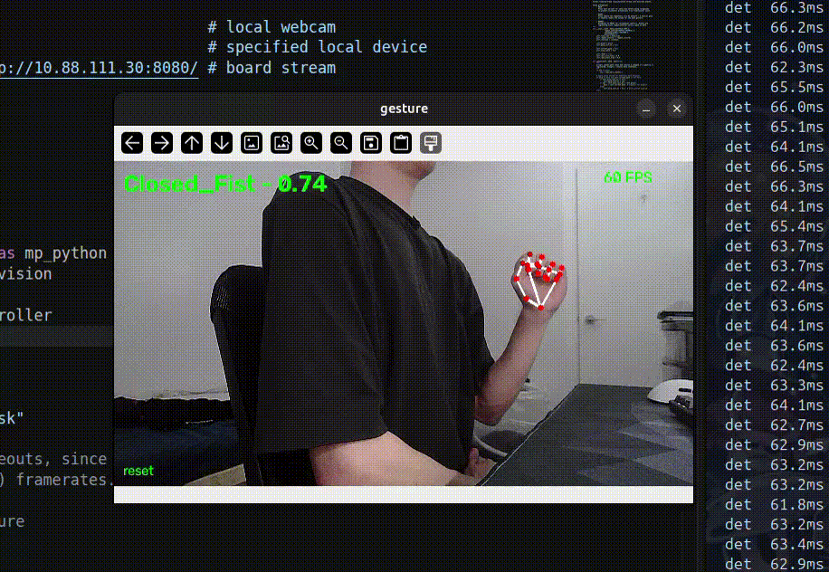

# Person-Tracking Camera with Remote Gesture Control

A pan-tilt camera assembly that tracks a person, keeps them centered, 
and streams clean video to a PC where hand gestures are translated 
into media controls.

Runs on an Arduino UNO Q, using both of its processors: the Qualcomm
QRB2210 (Debian Linux) handles the camera, neural network and tracking
logic, while the STM32U585 microcontroller generates servo PWM in hard
real time.

```
              UNO Q
┌──────────────────────────────────┐
│        QRB2210 / Debian          │
│                                  │
│  EMEET C960 Webcam               │
│         ↓                        │
│  camera capture                  │
│         ↓                        │
│  MobileNetV2 SSD FPN-Lite        │
│         ↓                        │
│  person bounding boxes           │
│         ↓                        │
│  target selection                │
│         ↓                        │
│  tracking controller             │
│         ↓                        │
│  desired pan / tilt              │
│         ↓                        │
│  MessagePack RPC                 │
│         ↓                        │
│  arduino-router                  │
│         ↓                        │
│     STM32U585                    │
│     │       │                    │
│    D9     D10                    │
│     │       │                    │
│   PAN     TILT                   │
│  MG90S   MG90S                   │
│                                  │
│  clean video                     │
│         ↓                        │
└─────────┼────────────────────────┘
          │
        Wi-Fi
          │
          ▼
         PC
          ↓
   gesture recognition
          ↓
   gesture event
          ↓
   music controller
```


My final assembly - minus the base. I'm rather proud of the wiring.




---

## Hardware

| Component | Notes |
|---|---|
| Arduino UNO Q | QRB2210 (Linux) + STM32U585 (MCU) |
| EMEET C960 webcam | USB UVC, MJPG at 640×360 |
| 2× MG90S servo | pan and tilt |
| Pan-tilt frame | 1/4" thread for camera mounting |
| Powered USB-C hub | |
| USB-C breakout board | separate servo power supply |
| 470 µF 16 V capacitor | optional, smooths servo current spikes |
| Breadboard, jumper wires (M-M, M-F) | also a lot of tape (electrical, masking, duct)|

Pan-tilt frame adapted from [Webcam Frame with Servos (MG90S)](https://www.printables.com/model/1351901-webcam-frame-with-servos-mg90s).

**Servo power.** The MG90S servo pair cannot be driven from the UNO Q
rail — the current draw exceeds what the board supplies. They are powered
from a separate 5V source and fed through a breakout board. The grounds
of the Arduino, the servos and the breakout board are all tied together.
A shared ground is mandatory; without it the PWM signal has no reference
and the servos behave erratically.

**Mechanical load.** The pan servo carries the tilt assembly and the
camera, but the tilt servo is more heavily loaded due to the top-heavy
webcam when it is tilted up or down. Accordingly, the tilt angle is
more strictly limited to prevent stalling.

---

## Repository layout

```
Tracking/
├── servo_slew.ino                MCU sketch: RPC handlers + slew-limited PWM
├── servo_controller.py           Linux-side RPC client (MessagePack over Unix socket)
├── tracker.py                    Tracking controller — pure logic, no hardware
├── tracking.py                   Main loop: capture → detect → track → servo → stream
├── requirements.txt              Board-side dependencies
│
├── remote/                       Runs on the PC, not the board
│   ├── gesture.py                MediaPipe gesture recognition + event filtering
│   ├── media_control.py          Gesture commands → playerctl / wpctl
│   └── gesture_recognizer.task
│
└── exploration/                  Development scripts, kept for reference
    ├── fov_measure.py            Camera field-of-view measurement tool (PC)
    ├── servo_rpc_test.ino        First working sketch, no slew limiting
    ├── servo_rpc_test.py         Raw MessagePack-RPC, documents the wire protocol
    ├── servo_rpc_time_test.py    RPC round-trip benchmark
    └── servo_controller_test.py  Servo sweep, useful for verifying wiring
```

The person detection model is located in the directory `Real-Time Human Detection/`.

---

## Architecture

The most important aspect of the design ended up being that **not every component
runs at the same rate**. Subsystems operate *separately* at the frequency their job
actually requires:

```
             FAST
              │
      ┌───────▼───────┐
      │ Servo control │        50 Hz, STM32
      └───────────────┘
           MEDIUM
              │
        ┌─────▼─────┐
        │ Tracking  │         ~12 Hz, Linux
        └───────────┘
           SLOWER
              │
        ┌─────▼─────┐
        │ Detection │         ~12 Hz, Linux
        └───────────┘
       HEAVIER / REMOTE
              │
        ┌─────▼──────┐
        │ PC gesture │        ~12 Hz, PC
        └────────────┘
```

The system feels responsive even though the expensive person detector 
runs at less than 12 Hz because the servo layer keeps moving smoothly between
detections. The Linux side decides *where to look*; the MCU decides *how to get
there*.

**QRB2210 / Linux** — camera capture, TensorFlow Lite inference, target
selection, tracking control, computing desired angles, networking.

**STM32U585** — receiving target angles, generating PWM, enforcing angle
limits, smoothing motion.

Smoothing on the MCU is necessary not just for throughput reasons. The 
MCU runs at a hard and jitter-free 50 Hz, whereas Linux is scheduling
TensorFlow, OpenCV, an HTTP server and the control loop across
four cores. Uneven timing would produce visibly uneven motion (it still does). 
But if the Linux process crashes mid-slew, the MCU holds its last position and 
keeps its safety clamps.

---

## How it works

### Detection

MobileNetV2 SSD FPN-Lite, 320×320 RGB input, INT8 quantized, adapted from
[Edge Impulse public project #121370](https://studio.edgeimpulse.com/public/121370/latest).
Single class (person), up to 10 detections per frame. Runs on CPU via
TensorFlow Lite with four threads.

Frames are captured at 640×360 MJPG and resized to 320×320. The resize
stretches 16:9 into a square; bounding boxes come back in that stretched
space and are denormalized against the original frame, so the geometry
remains consistent.

### Tracking

Bounding boxes are produced normalized as `[ymin, xmin, ymax, xmax]` in
`[0, 1]`. The target's centre is

$$x_c = \frac{x_{min} + x_{max}}{2}, \qquad y_c = \frac{y_{min} + y_{max}}{2}$$

and the error relative to frame centre is

$$e_x = x_c - 0.5, \qquad e_y = y_c - 0.5$$

Because the boxes are normalized, this error is expressed as a *fraction of the
frame*. Converting it to an angle requires the camera's field of view:

$$\theta_{err,x} = e_x \cdot \text{FOV}_h$$

A person half a frame off-centre is half a field of view off-axis. The
correction is proportional:

$$\theta_{pan} \leftarrow \theta_{pan} - K_p \cdot \theta_{err,x}$$

$$\theta_{tilt} \leftarrow \theta_{tilt} - K_p \cdot \theta_{err,y}$$

- $K_p$ — proportional gain, the fraction of the error corrected per update
- $\text{FOV}_h$ — horizontal field of view in degrees
- both axes subtract, because of the sign convention below

**Why proportional and nothing more?** An integral or derivative term could 
have been added, but neither were necessary. Proportinal control + deadband +
slew limit worked sufficiently well for a person walking around a room. No 
need to overcomplicate it.

- **Deadband** — errors under 4% of the frame are ignored, so detector
  jitter does not make the servos buzz while the subject stands still.
- **Angle limits** — the controller's state is clamped to the reachable
  range. Without this the accumulated command diverges from the physical
  angle whenever the target sits outside the servo's reach, and the
  controller never recovers.
- **Slew limiting** — handled on the MCU, see below.

### Coordinate conventions

```
Image space:  x increases RIGHT, y increases DOWN
Servo space:  pan  + => camera looks LEFT
              tilt + => camera looks UP
```

A person right of centre gives positive $e_x$ and requires panning right,
which means *decreasing* the pan angle. A person low in frame gives
positive $e_y$ and requires tilting down, also a decrease. Hence both
axes subtract.

### Target selection

Deliberately simple, constrained to the realistic case of one or two
people (the condo I live in has a pretty small kitchen):

```
0 people      → hold position
1 person      → follow
2+ people     → stay with whoever is closest to the previous target
target lost   → after ~15 frames, reacquire whoever is closest to frame centre
```

Nearest-to-previous-position is a cheap stand-in for identity across
frames and avoids needing a general multi-object tracker, which this
application does not warrant.

### Servo control

The STM32 sketch stores a *target* angle and walks the commanded output
toward it at a fixed 50 Hz:

$$\text{achievable motion per update} = \text{MAX-STEP-DEG} \times \frac{\text{update period}}{20\ \text{ms}}$$

`UPDATE_INTERVAL_MS = 20` is fixed by the hardware — standard hobby servos
sample their input once per 20 ms PWM frame, so commanding faster gains
nothing. `MAX_STEP_DEG` is the tuning knob; at 4.0° per tick the servos
move at 200°/s, comfortably under the MG90S's ~600°/s unloaded ceiling.

Angle limits are enforced on the MCU as a hard safety clamp, independent
of anything Linux believes. This duplicates the limits in the Python
controller — deliberately. They serve different purposes: the Python
clamp keeps the controller's model of the world honest, the MCU clamp
protects the mechanism.

### Communication

Linux and the MCU exchange data over MessagePack-RPC through the
`arduino-router` service. The Python side connects to a Unix domain
socket at `/var/run/arduino-router.sock`; the MCU exposes functions via
`Bridge.provide_safe()`, which runs handlers in the main `loop()` context
so they can safely call Arduino APIs.

The router claims `/dev/ttyHS1` on Linux and `Serial1` on the STM32.
**Do not access these directly.**

```shell
systemctl status arduino-router     # check
sudo systemctl restart arduino-router
journalctl -u arduino-router -f     # logs
```

### Streaming

MJPEG over HTTP on two endpoints:

- `/` — clean frames, consumed by the PC gesture model
- `/debug` — annotated frames with boxes, target marker, deadband and
  telemetry

Encoding is skipped entirely when nobody is connected to an endpoint, so
the debug path costs nothing in normal operation. Clean frames are the
default because bounding boxes are useful for human debugging but are
noise to the gesture model.

### Gesture recognition

Runs on the PC using MediaPipe's Gesture Recognizer task with its
pre-trained canned classifier — no training, no hand-tuned geometry. The
model recognizes seven gestures; five are mapped to commands and the
closed fist acts as a neutral reset.

| Pose | Command |
|---|---|
| Closed fist | neutral / reset |
| Open palm | play/pause |
| Pointing up | next track |
| Victory | previous track |
| Thumb up | volume up (repeats while held) |
| Thumb down | volume down (repeats while held) |

Only static poses. Temporal gestures like swipes were considered and
rejected: at ~12 FPS a swipe spans only three or four frames, and static
poses are dramatically more robust for no loss of function.

The classifier produces a per-frame label; turning that into clean
discrete events requires three filters:

- **Hold** — a pose must persist for 300 ms before firing, so the shapes
  a hand passes through on its way to a pose do not trigger commands.
- **Reset** — after firing, a pose cannot fire again until the hand
  returns to a non-command state. Without this, holding "next" for a
  second skips ten tracks.
- **Repeat** — an exception for volume, which is inherently incremental.
  Fires every 400 ms while held.
- **Grace** — brief classification dropouts do not reset the hold timer.
  A marginal pose flickers between itself and nothing; without this it
  can never accumulate enough continuous time to fire.

All timing is wall-clock rather than frame counts, because development
runs at 30 FPS locally and deployment at ~12 FPS over the network. A
frame threshold would mean different things on each.

### Media control

Two backends, because playback and volume are different things:

- `playerctl` speaks MPRIS over D-Bus and controls whichever *player* is
  active.
- `wpctl` controls PipeWire and adjusts the *system sink*, following the
  user between speakers and headphones.

Failures are non-fatal by design. A closed browser tab leaves a stale
D-Bus name behind, and that should print a line rather than kill a
running gesture session.


---

## Performance

Measured on the assembled system, 640×360 MJPG capture, four inference
threads.

| Metric | Value |
|---|---|
| Detector inference | 64–70 ms |
| Full loop (capture → detect → track → servo → encode) | 72–79 ms |
| Achieved rate | 12–13 Hz |
| RPC round trip (Linux → MCU → Linux) | 5.27 ms |
| Maximum RPC rate | ~190 Hz |
| Cost of the PC gesture client connecting | ~5 ms/frame, ~10% rate drop |
| Servo update rate | 50 Hz (hardware-fixed) |
| End-to-end latency (gesture → media action, excluding hold time) | < 500 ms |

The detector easily dominates, as expected. Everything else — tracking, RPC, JPEG encoding,
HTTP — accounts for under 10 ms combined.

The RPC measurement was quite a surprise: with a 5.27 ms round trip, Linux
*could* drive the servos directly at 30+ Hz. Smoothing was still placed on
the MCU, for the timing-stability and crash-safety reasons described
above rather than for throughput.



The end-to-end process runs extremely smoothly!

---

## Setup

### Board

```shell
pip install -r requirements.txt
```

Flash `servo_slew.ino` to the STM32 via the Arduino IDE or CLI.

Verify the webcam is enumerating and find its node:

```shell
v4l2-ctl --list-devices
v4l2-ctl --list-formats-ext -d /dev/video2
```

The QRB2210 exposes its hardware video encoder and decoder as V4L2
devices, which typically occupy `/dev/video0` and `/dev/video1`. The USB
webcam appears after them. **Open the camera by explicit path, not by
index** — node numbering shifts depending on enumeration order, and
`cv2.VideoCapture(1)` will silently open the SoC's video decoder instead.

Update `CAMERA_PATH` in `tracking.py` if the node differs.

### PC (Linux)

```shell
pip install mediapipe opencv-python
sudo apt install playerctl
```

The `gesture_recognizer.task` bundle is in `remote/`. To fetch from source:

```shell
wget https://storage.googleapis.com/mediapipe-models/gesture_recognizer/gesture_recognizer/float16/1/gesture_recognizer.task
```

### Calibration

Servo centres and limits are set in `servo_slew.ino` and
`servo_controller.py`. Verify with:

```shell
python3 exploration/servo_controller_test.py
```

Field of view must be measured, not taken from the spec sheet.
`exploration/fov_measure.py` overlays edge markers on a live preview:

```shell
python3 exploration/fov_measure.py --device /dev/video0 --width 640 --height 360
python3 exploration/fov_measure.py --compute --distance 1.50 --width-measured 2.55
```

$$\text{FOV}_h = 2\arctan\left(\frac{w}{2d}\right)$$

where $d$ is the perpendicular lens-to-wall distance and $w$ is the width
on the wall between the two frame-edge marks.

**FOV is mode-specific.** This webcam reports ~82° horizontal in its 16:9
modes and roughly 64° at 640×480, because the 4:3 modes crop the sides
off a 16:9 sensor. Measure at the resolution you actually run.
- Getting this one right was a huge pain, but accuracy depends on it.

---

## Running

Board:

```shell
python3 tracking.py                     # clean
python3 tracking.py --debug             # also serve annotated stream
python3 tracking.py --no-servo          # detection and tracking, no motion
```

PC:

```shell
python3 remote/gesture.py --source http://<board-ip>:8080/
python3 remote/gesture.py               # local webcam, for development
python3 remote/gesture.py --no-control  # recognise only, do not touch playback
```

`--no-servo` and `--no-control` are safe first runs for testing.

---

## Tuning

Change one knob at a time.

| Symptom | Cause | Fix |
|---|---|---|
| Wobbles while you move | gain too high, or commands exceed servo reach | lower `kp`, or raise `MAX_STEP_DEG` |
| Buzzes while you stand still | deadband too tight for detector jitter | raise `deadband_frac` |
| Lags behind a walking person | gain too low | raise `kp` |
| Motion looks jerky, stepwise | slew limit too low for the update period | raise `MAX_STEP_DEG` |
| Loses you when you move quickly | gain, or motion blur in low light | raise `kp`; cap camera exposure |
| Gestures never fire | pose held too briefly, or classifier below threshold | raise `--hold`, lower `--min-score` |
| Gestures fire repeatedly | reset condition not being met | check that a non-command pose is reached between gestures |

The relationship that matters most according to Claude (and I tend to agree):

$$\text{achievable motion per update} = \text{MAX-STEP-DEG} \times \frac{\text{update period}}{20\ \text{ms}}$$

This must comfortably exceed the largest correction $K_p$ will command.
When it does not, the controller accumulates commands the hardware never
executed, and its state diverges from the physical angle.

**Current working values:** `kp = 0.35`, `deadband_frac = 0.04`,
`MAX_STEP_DEG = 4.0`, `DETECT_HZ = 12.0`, `FOV_H_DEG = 82.2`,
`FOV_V_DEG = 52.2`.

Note that `DETECT_HZ` must be set *below* the achievable loop rate for
the pacing to engage. Setting it above simply lets the loop run flat out,
producing an update period that drifts with CPU load — and a controller
tuned against a fluctuating period is tuned against nothing.

---

## Conclusions

The project works! The camera follows a person around a room without
visible oscillation, streams video the PC receives stably, and five
gestures are reliably distinguished under ordinary indoor lighting.
End-to-end, a gesture produces a music change in **under half a second**
excluding the deliberate hold period — comfortably inside my initial target.

Some takeaways:

**The tiered rates beat uniform rates.** Instead of running every subsystem
at the same frequency, the detector at 12 Hz, tracking at
12 Hz, and servo control at 50 Hz resulted in a system that feels far more
responsive than the detector rate alone suggests, all because the servo
layer keeps moving between detections.

**Much debugging involved state diverging from reality.** The same
failure appeared several times... to list two, removing the Python-side 
angle clamps let the controller's state run to −309° while
the servo sat at its limit; a slew limit too small for the update period
let the controller command 40° jumps the hardware could only partly
execute. In both cases the controller's model of where the camera pointed
drifted away from where it actually pointed, and no amount of gain tuning
would have fixed either. This is why I'm not in ECE.

**Measure the hardware!!! Do not trust the specification.** The webcam's
advertised 90° is diagonal; the horizontal figure is ~82°, and at 640×480
it is closer to 64° because the 4:3 modes crop. OpenCV silently returns a
different capture mode than requested if the driver declines. Device node
numbering does not mean what it appears to mean. Each of these was found
by measuring (and wasting hours) rather than assuming...

---

## Possible extensions

- **Idle behaviour.** The camera currently holds its last position
  indefinitely when nobody is present. Returning to center after a
  timeout would be an easy addition.
- **Frame dropping on the stream.** MJPEG over HTTP queues frames when
  the client stalls rather than dropping them, so a temporarily loaded PC
  causes the stream to back up and then play catch-up — infrequently enough 
  that it doesn't matter, but it's still not ideal. A send timeout on
  the server, skipping frames rather than blocking, would degrade more
  gracefully.
- **Hardware video encoding.** The QRB2210's Venus encoder is exposed at
  `/dev/video0` and sits unused. Claude tells me I could make use of that...
- **MJPEG passthrough.** The webcam already outputs JPEG; the current
  path decodes it and re-encodes for streaming. Forwarding the original
  compressed bytes would skip a full encode per frame, at the cost of
  raw V4L2 capture instead of OpenCV.
- **Better multi-person handling.** Nearest-to-previous-position is
  adequate for one or two people but has no notion of identity. A
  lightweight appearance or motion model would handle crossing paths.
- **Hand exclusion.** Momentary flickers can cause the system to jump
  from one hand to the other, or even to another person. Fixing this 
  would however require a much more sophisticated tracking algorithm.
